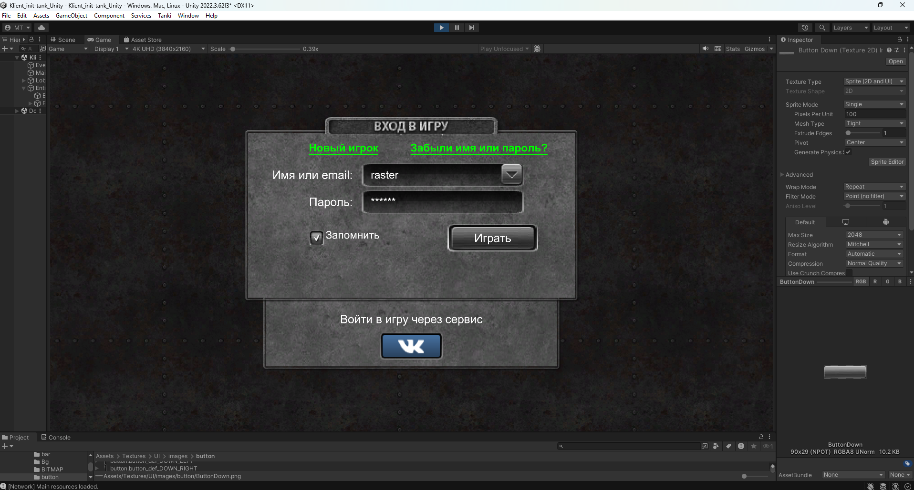
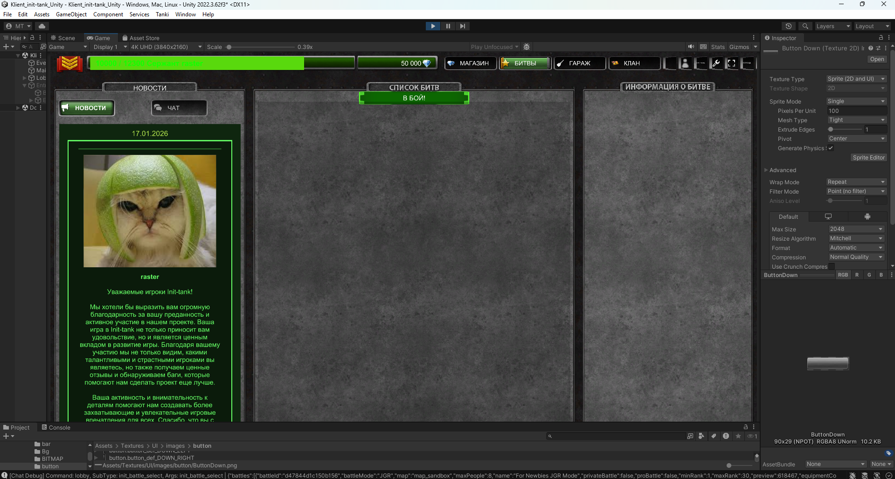

# 🛡️ Klient_init-tank_Unity
### *The Legacy Lives On: Reconstructing the Golden Era of Tanki Online*
### *Легенда продолжается: Реконструкция золотой эры «Танков Онлайн»*

---

## 🌟 The Vision / О проекте
**EN:** This project is a high-fidelity reconstruction of the legendary **Tanki Online** Flash client (2012-2015 era). We aren't just building a game; we are preserving a piece of gaming history. By migrating the original ActionScript 3 logic to **Unity & C#**, we bring modern stability and performance to the classic gameplay we all love.

**RU:** Этот проект — высокоточная реконструкция легендарного Flash-клиента **Танков Онлайн** (эпохи 2012-2015 годов). Мы не просто создаем игру, мы сохраняем частичку истории. Перенося оригинальную логику ActionScript 3 на **Unity и C#**, мы даем классическому геймплею современную стабильность и производительность.

---

## ✨ Key Highlights / Особенности

### 🎨 Pixel-Perfect UI Reconstruction / Пиксель-перфект интерфейс
*   **Legacy Skinning**: 1:1 recreation of the classic "Grey", "Green", and "Gold" UI button systems.
*   **Authentic Layouts**: Every pixel of the Lobby, Chat, and Entrance screen is measured against the original client.
*   **RU:** Воссоздание оригинальных скинов кнопок (Серые, Зеленые, Золотые) и точное соблюдение всех отступов и координат оригинального лобби и чата.

### ⚙️ Engine & Architecture / Движок и Архитектура
*   **OSGi-Inspired Core**: A robust service-registry system that mirrors the original `alternativa.osgi` pattern.
*   **Legacy Networking**: Native support for the **FlashTanki** protocol (`~dne` delimiters, AES & Shift encryption).
*   **RU:** Архитектура на базе сервисов (вдохновленная OSGi), поддержка оригинального сетевого протокола и шифрования AES/Shift для совместимости со старыми серверами.

---

## � Screenshots / Скриншоты

| Login Screen / Экран входа | Lobby Client / Лобби клиент |
| :---: | :---: |
|  |  |

---

## �📊 Current Roadmap / План развития

| Feature / Функционал | Status / Статус | Description / Описание |
| :--- | :---: | :--- |
| **Project Core** | ✅ | Environment setup, Git integration. / Настройка окружения и Git. |
| **Lobby UI** | 🏗️ | Entrance, Top Panel, and Chat. / Экран входа, верхняя панель и чат. |
| **Networking** | 🛠️ | Socket implementation and handshake. / Реализация сокетов и рукопожатия. |
| **Battle System** | 📅 | *Planned:* Tank physics. / *В планах:* Физика танков. |

---

## 🛠️ How to Launch / Как запустить
1. **EN:** Ensure you have **Unity 2022.3.62f3** installed.
2. **EN:** Use the provided `launch_unity.bat` for a guaranteed version-safe startup.
3. **RU:** Убедитесь, что установлена версия **Unity 2022.3.62f3**.
4. **RU:** Используйте файл `launch_unity.bat` для гарантированного запуска в нужной версии.

---

## ⚖️ Legal Disclaimer / Правовая информация
*This repository is for educational and archival purposes. All original assets, trademarks, and brand names are the property of Alternativa Games. This is a community-driven preservation project.*

*Данный репозиторий создан исключительно в образовательных и архивных целях. Все оригинальные ресурсы и торговые марки принадлежат Alternativa Games.*

---
**Maintained with ❤️ by [radiomonter](https://github.com/radiomonter)**
